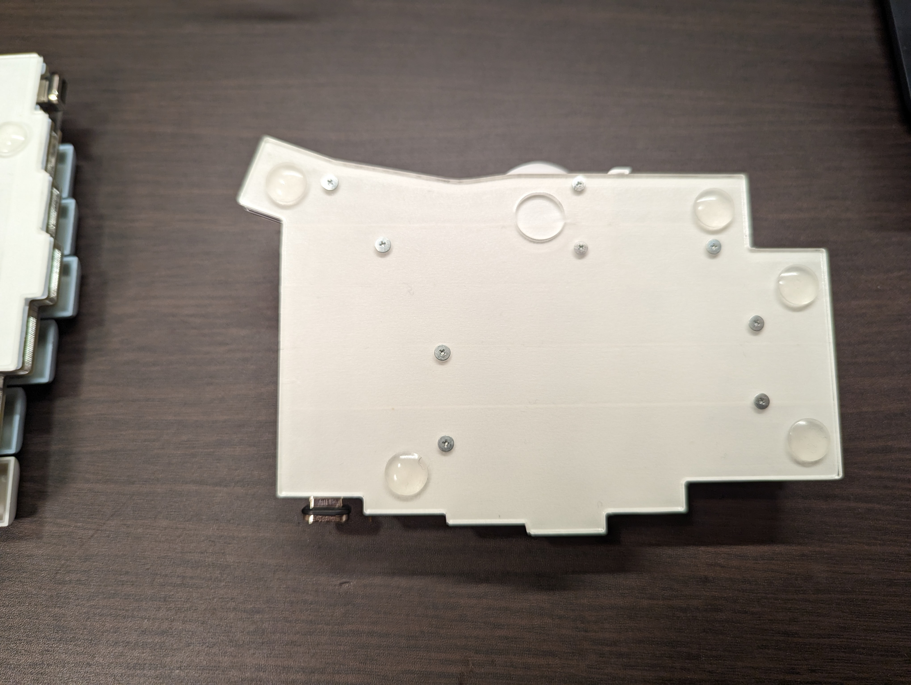
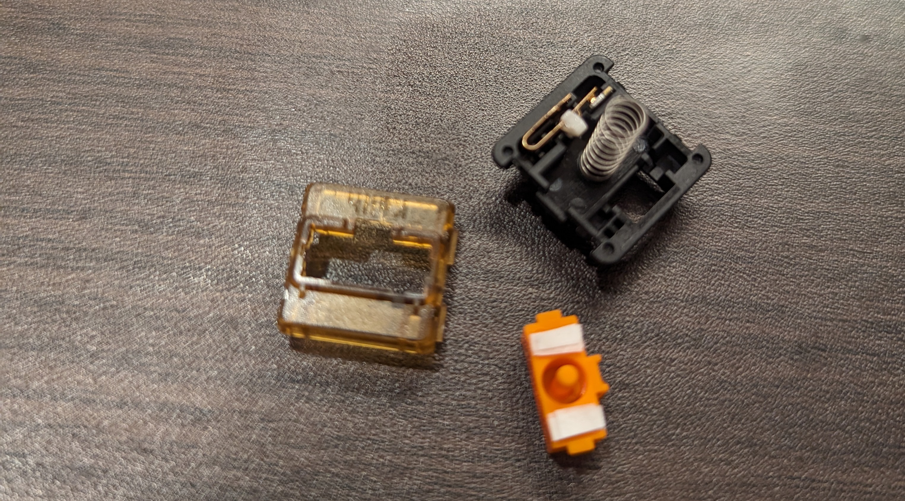

## Keyball44 を購入した理由

普段は Choco60 rev.2 と MX ERGO を使っているのだけど、どうしてもマウスへ手を動かしてホームポジションから手が移動するのをなんとかしたいと思ったのが理由です。

## Keyball44 のつかいごこち

まだまだ使い始めたばかりのためそもそもタイピングもままならないのですが、概ね良さそうです。
元々 HHKB や Choco60 rev.2 のようにロウスタッガード（キーが横にズレたレイアウト）のキードードをずっと使っていたので Keyball44 のようにカラムスタッガード（キーが縦にズレたレイアウト）のキーボードでの指の動かし方がわかりません状態です。特に癖だったのか C を打とうとして人差し指を下げる動きをするのですが、カラムスタッガードでは中指を下げないと届かないので何回も失敗しています。

キー数自体が少ないのでレイヤーを駆使してやりくりする必要があるところにもまだまだ慣れが必要です。レイヤーやキーマップは qmk を使って自分でカスタマイズしたものをマイコンに書き込む形で使えるので今後色々と試行錯誤したいところです。

https://github.com/qmk/qmk_firmware

ホームポジションから手を動かさずにトラックボールがつかえるのはとてもよかったです。一方で親指を手のひらの下に押し込む形で使う必要があるのでこれまでの MX ERGO とはちがいだいぶ手首に負担がかかりしばらく使っていると痛みが出てきます。このあたりはキーボードむきやテンティングによってある程度解消しそうなのでこのあたりも調整が必要です。

## 構成

- Keyboard: Keyball44
- Switch: Kailh Midnight Silent V2 Tactile / Kailh Sunset Tactile
- Keycap: XVX Sky Blue XVX Profile PBT

## 静音化

### ボトムプレートにマステを貼る

ボトムプレートにマステを 5 重にはります。テープモッド言われる静音化方法で自作キーボード界隈では一般的なようです。本来は基盤側に春っぽいんですが、凹凸があって貼りづらいのでボトムプレート側にはりましたが問題なさそうです。高音が響く感じが抑えられてスコスコなるような感じになりました。

### 親指に使ってるキースイッチにマステを貼る

底打ち時の音を軽減するため親指部分に使用した Kailh Sunset Tactile を分解して、写真の白い部分のようにマステを 8 重ではります。
low profile で静音軸がないので他の指のキーに比べるとまだどうしても音が大きいです。low profile の静音軸だしてほしい。

## キーマップやレイヤー

ここにあります。

https://github.com/futabooo/qmk-firmware-keyball44

キーマップはまだカスタムするのが怖くて一般的な US キー配列っぽくしています。これだと Mac のアプリ固有のショートカットなどいくつかのキーを押さないといけない時に苦労してるのでいずれカスタムすることにはなりそうです。。

[Automatic Mouse Layer](https://docs.qmk.fm/#/feature_pointing_device?id=pointing-device-auto-mouse)を有効にしており、トラックボールを動かすと勝手にレイヤーが変わるようにしています。マウスレイヤーへはクリックキーを設定してブラウジングしてるだけのときなどは右手一本で行けるような形を目指しています。まだブラウザの戻るや進むを割り当てていないのでこれをなんとかしないといけない状況です。

## おわりに

XVX プロファイルのキーキャップを気に入って使っているのですが、44 キーのときにいい感じにキーが揃っていないので見た目がちょっと残念なのをなんとかしたいですねぇ。他の色合いだとキー数が多いのでもうちょっとなんとかなりそうなのですが ProMicro や TRS ケーブルも青系で揃えたので青系のキーキャップがいいと思っています。XVX プロファイルではなくても OEM や CherryMX あたりは近い形状なのでおすすめがあればぜひ教えてほしいです。

## 各種リンク

<https://shirogane-lab.net/items/64b7a006eb6dbe00346cd0c5>

<https://www.amazon.co.jp/Midnight-Silent-Tactile-%E3%83%A1%E3%82%AB%E3%83%8B%E3%82%AB%E3%83%AB%E3%82%AD%E3%83%BC%E3%83%9C%E3%83%BC%E3%83%89%E7%94%A8-%E9%9D%99%E9%9F%B3%E3%82%BF%E3%82%AF%E3%82%BF%E3%82%A4%E3%83%AB%E3%82%B9%E3%82%A4%E3%83%83%E3%83%81/dp/B0BLSYCZF6?__mk_ja_JP=%E3%82%AB%E3%82%BF%E3%82%AB%E3%83%8A&crid=37HJVYNH6STSB&keywords=Kailh+Midnight+Silent+V2+Tactile&qid=1696439738&sprefix=kailh+midnight+silent+v2+tactile%2Caps%2C167&sr=8-1&linkCode=ll1&tag=futabooo-22&linkId=a8f41877cbe3fef73424f2feab516f81&language=ja_JP&ref_=as_li_ss_tl>

<https://www.amazon.co.jp/Sunset-Tactile-Switches-%E3%82%AD%E3%83%BC%E3%83%9C%E3%83%BC%E3%83%89%E3%82%B9%E3%82%A4%E3%83%83%E3%83%81-%E3%83%A1%E3%82%AB%E3%83%8B%E3%82%AB%E3%83%AB%E3%82%AD%E3%83%BC%E3%83%9C%E3%83%BC%E3%83%89%E7%94%A8%EF%BC%8835%E5%80%8B%E5%85%A5%E3%82%8A%E3%83%9C%E3%83%83%E3%82%AF%E3%82%B9%EF%BC%89/dp/B0BXGY6T8J?__mk_ja_JP=%E3%82%AB%E3%82%BF%E3%82%AB%E3%83%8A&crid=2WPFUQONZLOL0&keywords=Kailh+Sunset+Tactile&qid=1696440499&sprefix=kailh+sunset+tactile%2Caps%2C172&sr=8-1&linkCode=ll1&tag=futabooo-22&linkId=6a44ecf4f78b551608df6e28927d5581&language=ja_JP&ref_=as_li_ss_tl>

<https://www.amazon.co.jp/gp/product/B0BKZLX5PC?ie=UTF8&psc=1&linkCode=ll1&tag=futabooo-22&linkId=ff863cc02fd47681f73858811d947a1a&language=ja_JP&ref_=as_li_ss_tl>
