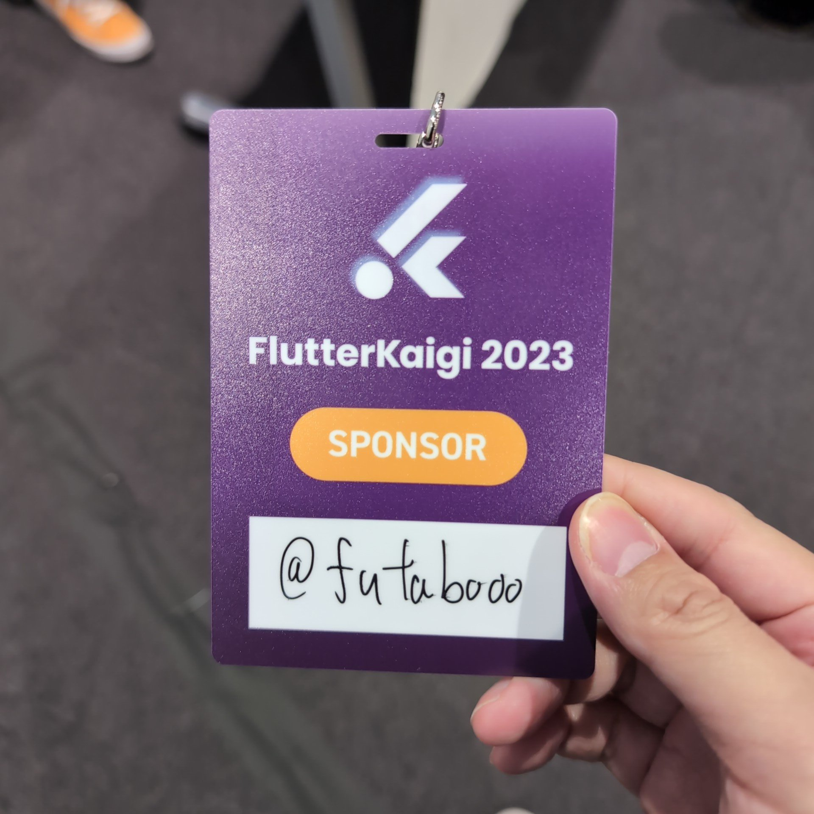

## はじめに

FlutterKaigi2023 のスポンサーブースに 10X 社員として参加してきました。
オフラインでの技術カンファレンスのスポンサー企業社員としての参加は多分 4,5 年ぶりで前職の時に DroidKaigi でスポンサーした時以来だと思います。

とっても久しぶりに参加したのですが、もっとやれたなーとか思った部分があったので未来の自分に向けてまたもし企業ブースに社員として立つことがあったら意識したいことを残しておくことにしました。

## 意識したいこと

### 楽しそうにする

企業ブースで出会う社員はその会社の顔として参加することになります。どんな人が働いているのか？人となりを意識しててもしてなくても話を聞きに来てくれた参加者の方へ与えることになります。嘘や取り繕ったりする必要は無いのですが、大変なことでも楽しそうに話している人とだったら同じ会社で働いて大変な場面に遭遇しても一緒になんとか乗り越えていけそう！みたいに自分だったら思います。

具体的には「笑顔、立って話をする、テーブル越しではなく横に並んで話をする」みたいなことは最低限意識してみるといいのかもしれません。特に最後のテーブル越しではなく横に並んでというところは結構いいと思っています。人がたくさんブースに来るとテーブル越しでは一度に話せる人数が少なくなっちゃうのでちょっとずれて自分を取り囲んでもらうような形を作るぐらいのほうが沢山の人と話ができると思います。あと普通に印象いいと思います。（個人の感想です）

### 相手が聞きたい話をする

なにを当たり前なことをという感じなのですが、いっぱいアピールしたい！という気持ちがあるので話したいことを話してしまうことも多いです。技術カンファレンスなので参加者のみなさんは基本的には発表を聞きに来ていると思います。発表と発表の間の休憩時間（FlutterKaigi2023 では 15 分）で話を聞きに来てくれる人は少なからず自社に興味を持ってくれていて気になってることがあると思います。エレベーターピッチよりは時間があるので一方的に自社のアピールをするのではなく気になってることを解消するために相手の話を聞くぐらいの気持ちでもいいかもしれません。とはいえ話を聞きに来てくれている、面接ではないので深ぼるような質問とかはしないほうがいいと思います。

ちなみに自分は Flutter とネイティブの連携の話を聞かれて[Braze](https://www.braze.co.jp/)の話ばかりしてしまったので後悔しています。その後ちゃんと Push 通知やカメラやハードウェアとの通信あたりも話ができたのでなんとかなりました。

企業ブース社員として参加した印象として 10X のところへ話を聞きに来てくれる人は「Server Side Dart ってどうなんですか？」という質問をしてくれたり、「Dart の会社というイメージがあるがプロダクトはなにやってるんですか？」という質問をしてくれた方が多かったように思います。

### X(旧 Twitter)アカウントでフォローする

せっかく話を聞きに来てくれた人に対して後でこちらから連絡できないのってとても勿体ないと思います。一通り話したあとは最後に相互フォローできるととっても良いと思います。自分の今後の投稿をみてさらに自社に興味を持ってもらうこともできるかもしれません。あとは単純にカンファレンスで知り合い増えると楽しいです。自分のアカウントのアイコン画像をシールに印刷してネームプレートに貼るっていうのをやったりすると実はフォローしてくれていたり見たことあるって言ってもらえることもあるのでおすすめです。自分は忘れました。

企業さんによってはアンケートフォームでメアドもらって連絡していいですか？としていたり Twitter アカウント書いてもらって連絡したりなどしているところもあったのでなるほどなーと思いました。

## おわりに

なんか色々思った事はあったはずなのですが、たくさん喋ったから疲れたのか家に帰ってきたらあんまり覚えてませんでした orz

次回は思ったことはすぐにメモを取りましょう。
