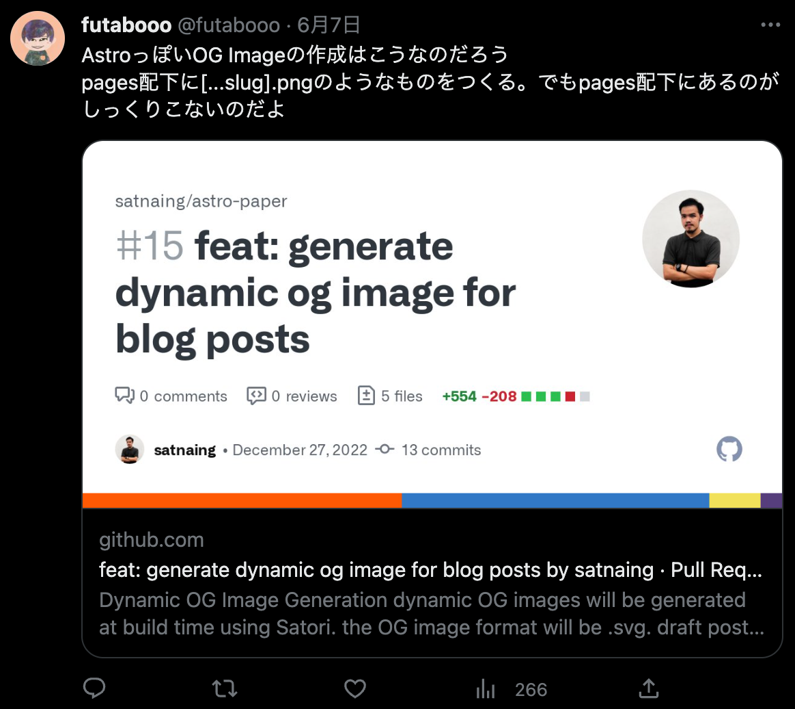
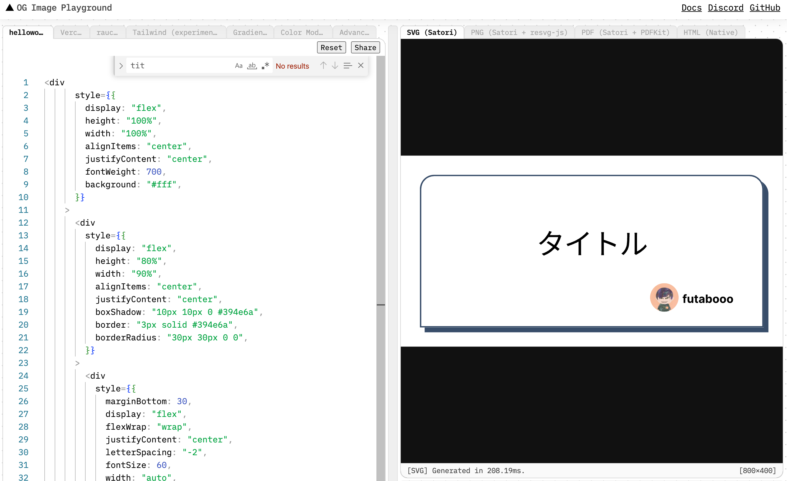

## OGImage とは

こういうやつですね。


Twitter などにリンクを貼り付けた時に特定の metadata に設定されている URL を表示してくれるやつです。

## OGImage 用の png 画像を作成する

個人のブログで毎回画像を手で作るのはしんどいので、テンプレ的な画像内の文字だけ変えるようなものを作成します。
Astro Integration API を使って build 完了時に画像生成処理を呼び出すと言う方法で実現しました。
画像は satori と sharp を使って jsx から png 画像を生成します。

https://docs.astro.build/en/reference/integrations-reference/

https://github.com/vercel/satori

https://github.com/lovell/sharp

下記に実際のコードのせておきます。

`src/integrations/ogimage.tsx`

```tsx
import type { AstroIntegration } from "astro";
import fs from "node:fs";
import path from "node:path";
import { fileURLToPath } from "node:url";
import satori from "satori";
import sharp from "sharp";

# satoriとsharpを使ってpng画像を作る
const generate = async (title: string) => {
  const __filename = fileURLToPath(import.meta.url);
  const __dirname = path.dirname(__filename);
  const font = fs.readFileSync(
    path.resolve(__dirname, "NotoSansJP-SemiBold.ttf")
  );
  const svg = await satori(
    <div
      style={{
        height: "100%",
        width: "100%",
        display: "flex",
        flexDirection: "column",
        alignItems: "center",
        justifyContent: "center",
        backgroundColor: "#fff",
        fontSize: 32,
        fontWeight: 600,
      }}
    >
      <svg
        width="75"
        viewBox="0 0 75 65"
        fill="#000"
        style={{ margin: "0 75px" }}
      >
        <path d="M37.59.25l36.95 64H.64l36.95-64z"></path>
      </svg>
      <div style={{ marginTop: 40 }}>Hello, World</div>
    </div>,
    {
      width: 1200,
      height: 630,
      fonts: [
        {
          name: "Noto Sans JP",
          data: font,
          style: "normal",
        },
      ],
    }
  );
  return await sharp(Buffer.from(svg)).png().toBuffer();
};

export const createOGImage = ({
  config,
}: {
  config: { path: string };
}): AstroIntegration => {
  return {
    name: "og-image",
    hooks: {
      "astro:build:done": async ({ dir, pages }) => {
        const blogPages = pages.filter((page) =>
          page.pathname.includes(config.path)
        );

        await Promise.all(
          blogPages.map(async (page) => {
            const indexHtmlPath = path.join(
              dir.pathname,
              page.pathname,
              "index.html"
            );

            const indexHtml = fs.readFileSync(indexHtmlPath, "utf8") as any;
            const title = await indexHtml.match(
              /<title[^>]*>([^<]+)<\/title>/
            )[1];
            const buffer = await generate(title);
            const filename = path.join(dir.pathname, page.pathname, "ogp.png");
            // 非同期のfs.writeFileだと生成がうまく以下あない場合があるので同期的に書き込む
            fs.writeFileSync(filename, buffer);
          })
        );
      },
    },
  };
};
```

`astro.config.mjs`

```js
export default defineConfig({
  integrations: [
    ...createOGImage({
      config: {
        path: "blog/",
      },
    }),
  ],
});
```

`await satori()`の第 1 引数に渡している jsx が最終的なレイアウトを決める感じです。
jsx で書くために react も導入が必要なので入れておきます。

https://docs.astro.build/en/guides/integrations-guide/react/

## Playground を使ってレイアウトを作成する

公式の Playground 環境があるのでそこで style を調整するとレイアウトは比較的ラクに作れます。

https://og-playground.vercel.app/



## SSG するか SSR するか

今回の自分の方法は SSG ということになるとおもいます。OGImage 自体は build 時に作成して dist 配下に保存してあります。SSR で作成する方法もあり、それはこの記事の最初にはった GitHub の画像のリポジトリで行われている方法で、Astro の Endpoints 機能を使って実現されています。

https://github.com/satnaing/astro-paper/pull/15

https://docs.astro.build/en/core-concepts/endpoints/
