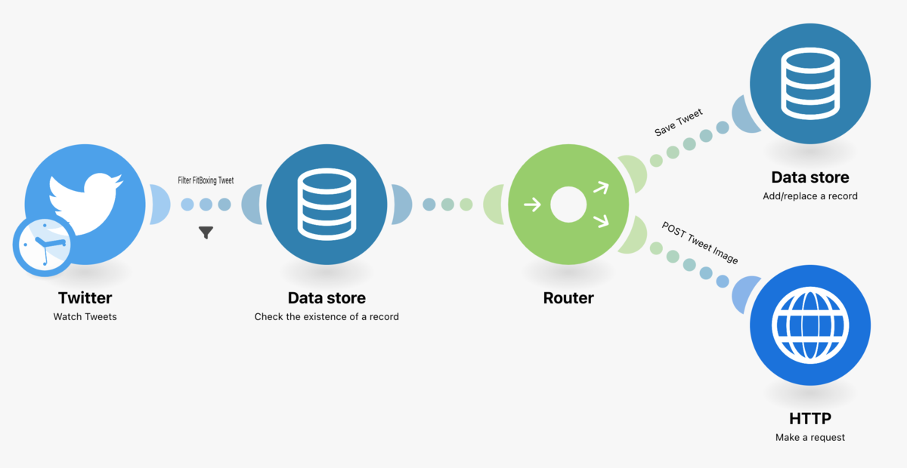
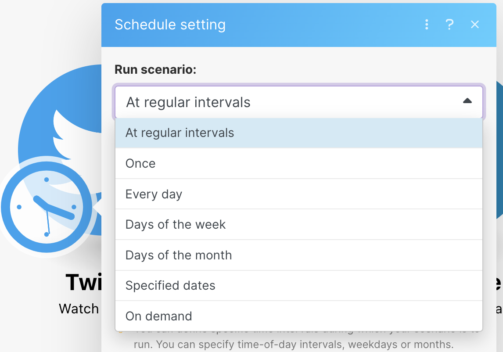
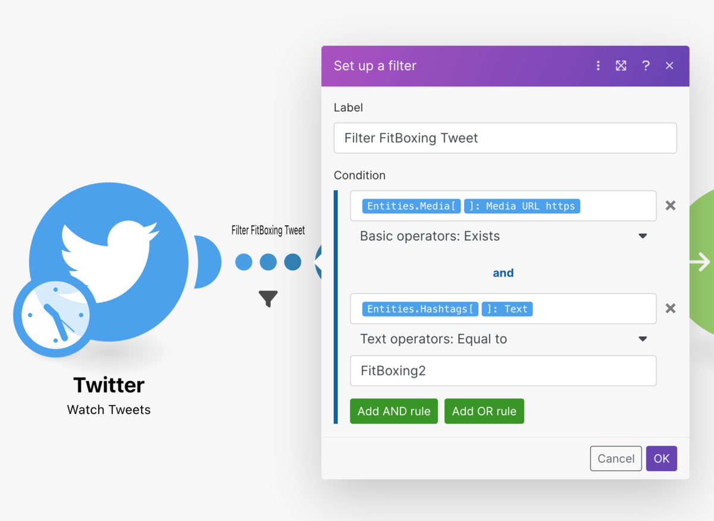
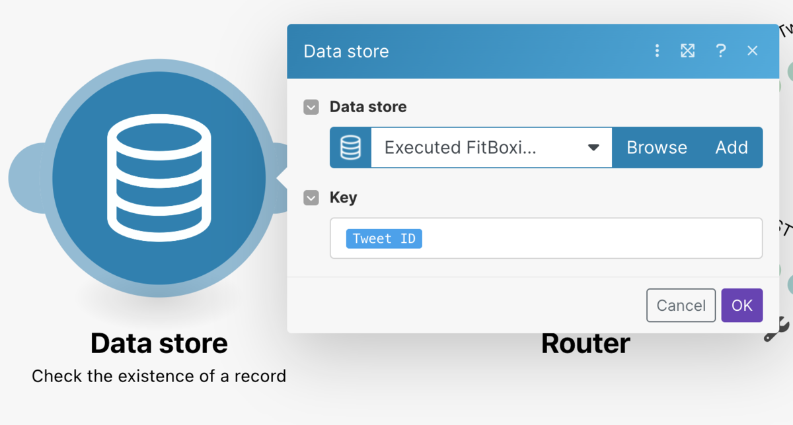
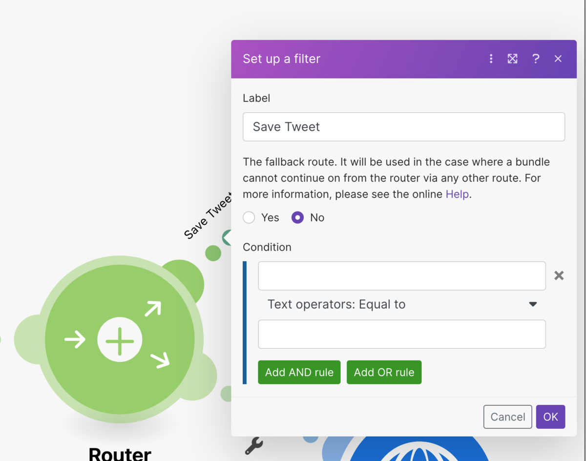
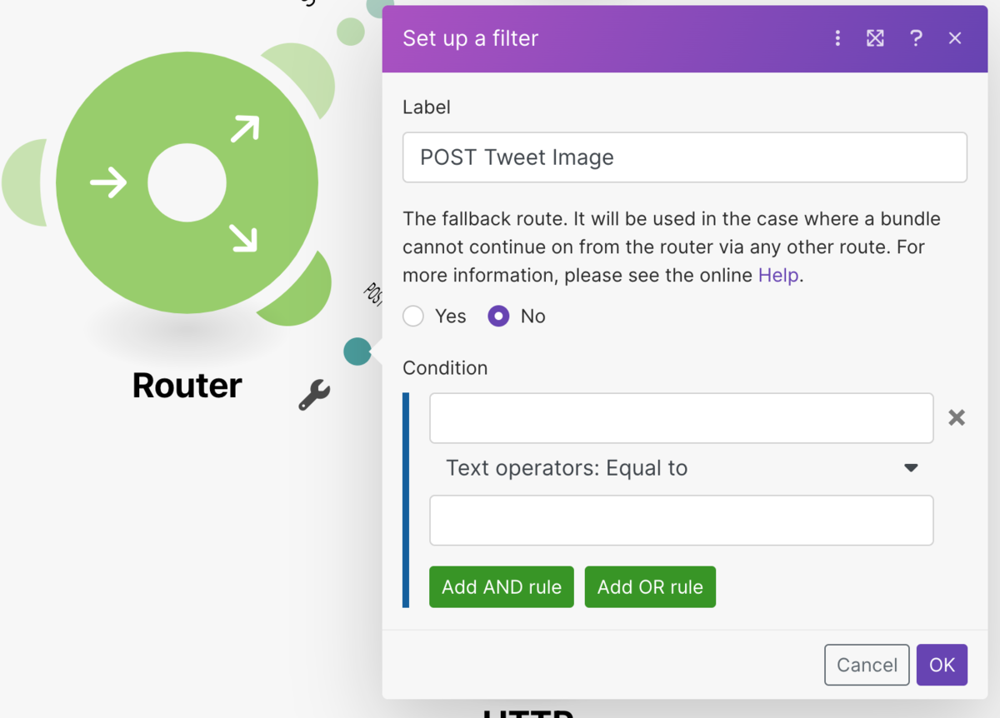
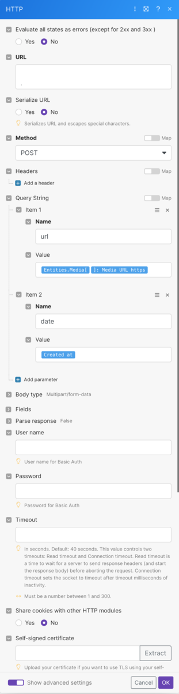

FitBoxing2 の記録をつけたいなーと思い Zapier で最初やろうと思ったけど POST request するのに月 2 千円は払えないなぁと思ってしまったので[Make（旧 Integromat）](https://www.make.com/en)を使ってやってみました。

## 全体像

今の所運用してるワークフローはこんな感じ。

### 大まかな流れ

1.  15 分に 1 度 5 件ツイートを取得する
2.  \#FitBoxing2 の[ハッシュタグ](http://d.hatena.ne.jp/keyword/%A5%CF%A5%C3%A5%B7%A5%E5%A5%BF%A5%B0)があるツイートは次のステップへ進む
3.  ツイート ID が Data store に保存されていなかったら次のステップへ進む
4.  Router で処理を 2 つに分岐させる
5.  1 つは Data store へツイート ID を保存する、もう一つは POST request を発行する

## ツイートの取得

Zapier のようにツイートするごとにトリガーするようなものが無いので時間間隔を設定したり、特定の時間を指定したりしてトリガーを設定できます。

今回は 15 分に一回 5 件のツイートを取得するようなトリガーを設定しました。

またモジュール（Make では、丸いのがモジュール）間の点はフィルターが設定することができるので、次のステップへ進むのは画像つきで#FitBoxing2 の[ハッシュタグ](http://d.hatena.ne.jp/keyword/%A5%CF%A5%C3%A5%B7%A5%E5%A5%BF%A5%B0)付きツイートだけというフィルターを設定しました。

## Date store にツイート ID が保存済みかどうか確認する

画像つきで#FitBoxing2 ありのツイートだけ
すでに POST request を作成したトリガーとなったツイート ID は最後に Data store へ保存しているので、その ID が存在するかを確認しています。

ツイート ID が存在しなければ次のステップへ進みます。

## Router で処理を 2 つに分ける

未処理のツイートだったら Data store への ID 保存を POST request の作成をやるように Router で処理を 2 つに分岐させています。

## POST request する

ツイートの画像 URL とツイートした日時を特定の URL に POST します。
受け口は CloudRun を用意していてそこでは CloudVisionAPI を使って消費消費カロリーを抽出、pxela へ POST して記録するという流れを実装しています。

<iframe src="https://hatenablog-parts.com/embed?url=https%3A%2F%2Fpixe.la%2Fja" title="Pixela | あなたの頑張りや継続を記録し、育てたい。そのすべてを、APIで。" class="embed-card embed-webcard" scrolling="no" frameborder="0" style="display: block; width: 100%; height: 155px; max-width: 500px; margin: 10px 0px;" loading="lazy"></iframe>
<cite class="hatena-citation"><a href="https://pixe.la/ja">pixe.la</a></cite>

## おわりに

これでフィットボクシングしたら Switch からツイートすることで消費カロリーの草を生やすことができるようになりました。

それにしても[Make（旧 Integromat）](https://www.make.com/en)ってなんて検索しづらいんだ、、、ほとんど日本語の情報出てこないですね。
