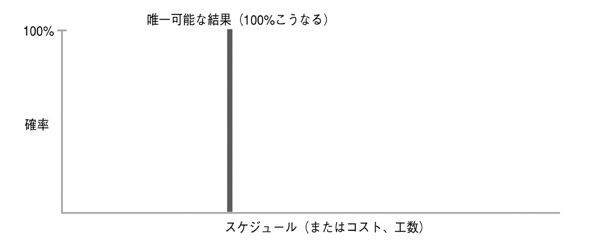
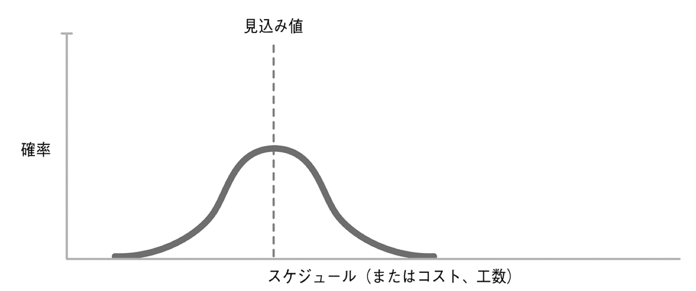
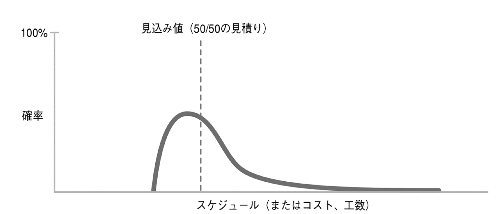
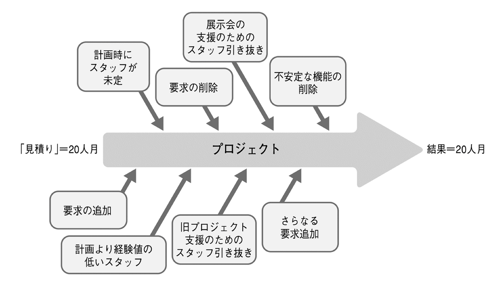

この記事は [10X アドベントカレンダー 2023](https://10xall.notion.site/10X-2023-c074cdda2c9b4ac997d9ec0543f74931) という企画の 2 日目（12/2）の記事です。

1 日目（12/1）の昨日は岡野さん（[@operandoOS](https://twitter.com/operandoOS)）による「[CI を高速化する技術 ⚡️](https://product.10x.co.jp/entry/2023/12/01/113134)」でした。

---

## はじめに

この記事の内容は以下の本の第一章とほぼ同じ内容となります。この記事の読んで見積りについて興味が湧いたらぜひ以下の書籍に目を通してみてください。

出典 [ソフトウェア見積り 人月の暗黙知を解き明かす](https://www.amazon.co.jp/dp/B00KR96M6K)

---

早速ですが見積りしてますか？おそらくソフトウェアエンジニアの方であれば、こんな感じで会話して見積りした経験が 1 度はあるんじゃないでしょうか？

```
プロダクトマネージャー「機能xyzの件だけど、開発期間はどのくらいだと見積もってる?」

ソフトウェアエンジニア「1ヶ月ですね。」

プロダクトマネージャー「長すぎる。1週間で何とかならないか。」

ソフトウェアエンジニア「どんなにがんばっても3週間は必要ですよ。」

プロダクトマネージャー「2週間、それ以上は無理だな。」

ソフトウェアエンジニア「わかりました。2週間でなんとかします。」
```

私自身も思い返してみると似たような会話をした結果、開発が間に合いそうになく睡眠時間を削って対応する、、、なんてこともあったようななかったような気がします。

## 見積り、ターゲット、コミットメントを使い分ける

先程の会話について、見積り、ターゲット、コミットメントというように同じ期間についての話でも異なる意味を持つやり取りが発生していました。

```
プロダクトマネージャー「機能xyzの件だけど、開発期間はどのくらいだと見積もってる?」

ソフトウェアエンジニア「1ヶ月ですね。」 -> 見積り

プロダクトマネージャー「長すぎる。1週間で何とかならないか。」

ソフトウェアエンジニア「どんなにがんばっても3週間は必要ですよ。」

プロダクトマネージャー「2週間、それ以上は無理だな。」 -> ターゲット

ソフトウェアエンジニア「わかりました。2週間でなんとかします。」 -> コミットメント
```

### 見積り

ソフトウェアエンジニアが最初に言った「1 ヶ月」とは見積りです。
彼は過去に xyz 機能と同じもしくは似た機能を作ったことがありその時にかかった期間から答えたのかもしれません。
もしくは全くやったことがないが 1 ヶ月あればなんとかなるだろうと楽観的に答えたのかもしれません。

このように見積りとは**あくまで概算でおおまかな判断**であり、正確さを期待することはできません。

（機能 A の開発に要する時間は 234.14 日です、というような見積りは本来ありえない）

### ターゲット

プロダクトマネージャーが最後に言った「2 週間」はターゲットです。
例えば下記のようなものもターゲットです。

- 5 月の展示会でデモができるように、バージョン 2.1 を完成させなければならない
- 年末年始の商戦に間に合うように、このリリースを安定させなければならない
- 法令へのコンプライアンス上、これらの機能は 7 月 1 日までに完成させなければならない

つまり**実現したいビジネス上の目標を明文化したもの**がターゲットです。

### コミットメント

ソフトウェアエンジニアが最後にいった「わかりました。2 週間でなんとかします。」はコミットメントです。
コミットメントは約束と言い換えることもできます。

**定義された機能を、特定の品質レベルを確保しながら期日までに納品するという約束**がコミットメントです。

---

このように見積りと普段言っているものは、見積り、ターゲット、コミットメントの 3 つに分けることができます。見積りをうまく使うためにもこの 3 つの違いを一緒に働くメンバー間で合わせておけると最初の例にのせたような会話にはならず、ソフトウェアエンジニアが徹夜してなんとかするということも無くなるでしょう。

## 良い見積り

良い見積りとはなんでしょうか？

1 ヶ月と見積もった開発が 1 ヶ月以内で終わると見積りが良かったとなりますでしょうか？
逆に 1 ヶ月よりも長くかかってしまうと見積りが悪かったとなりますでしょうか？
1 ヶ月、つまり 30 日と見積もった開発が 20 日から 40 日ぐらいで終わるとまぁまぁ良かったとなりませんか？
このように実際には 1 ヶ月と見積もった開発期間が 100％一ヶ月で終わることはなく確率が存在するはずです。

1 ヶ月という見積りを聞くと以下のようなシングルポイントの見積りをイメージをすると思いますが、実際は 2 つめのように確率分布となるはずです。（このとき山の一番上が 1 ヶ月となってるイメージ）





さらに実際の開発においては後半になって問題が発覚することが多く裾が伸びていくような分布となります。



このように単純に 1 ヶ月というと 100％の確率で 1 ヶ月で完了するというように見えるが実際のところは下記のように確率があり、中央値を 1 ヶ月として見積りしているということになります。

- 10 日で終わる確率 10％
- 20 日で終わる確率 20％
- 1 ヶ月(30 日)で終わる確率 50％
- 40 日で終る確率 10％
- それ以上かかる確率 10％

最初の例で書いた会話の中で出てくる機能 xyz を開発する際の見積りにおいては
「2 週間以内で終わる確率 10%、1 ヶ月以内に終わる確率 80％、それ以上かかる確率 90％」という見積りが良い見積りとなります。

つまり**良い見積りとは確率が明示された見積り**です。

---

ではなぜ確率を明示した見積りが良い見積りなのでしょうか。いくつか理由があります。

1. 不確実性の考慮：ソフトウェア開発は複雑なプロセスであり、多くの不確実性が存在します。確率分布を使用することで、開発の不確実性を考慮することができます。
2. リスク管理：確率分布を使用することで、プロジェクトのリスクを評価し、管理することができます。確率的な見積もりに基づいてリスクを把握し、適切な対策を講じることができます。
3. 精度の向上：単一の見積もりでは、予期しない問題や遅延が発生した場合に対応できません。確率分布を使用することで、開発の複数のシナリオを考慮し、より現実的な見積もりを得ることができます。
4. 判断の支援：確率分布を使用することで、プロジェクトのリソース配分や優先順位付けに対する意思決定を支援することができます。リソースを最適に配置するために、異なる見積もりシナリオを分析することができます。

以上のような理由から確率を明示した見積りが良い見積りであると言えます。

## 見積りとプロジェクトマネジメント

実際のプロジェクトを考えてみます、



上記のようにプロジェクト開始時から完了時までに様々な変更があっても結果として見積りと同じ人月で完了したら見積りは正確だったと評価できるでしょうか？プロジェクトマネジメントが良かったとは言えるかもしれませんが見積りとしての評価は結果論でしかありません。プロジェクトの成功には良い見積りだけではなくプロジェクトマネジメントも必要になります。

正確な見積り、適切なターゲットの設定、適正なプロジェクトマネジメント（計画とコントロールの三拍子）が揃って、「見積り」に近いプロジェクトの結果が実現できるのです。

## おわりに

今回の記事の内容は 10X の Product Friday という隔週で金曜日にやっている勉強会で話した内容をブログ用にリライトしたものです。Product Friday ではプロダクトマネージャーやデザイナー、エンジニアなどが日々の業務の中で得た知見や学びをみんなにも共有するためにやっているもので、職種を超えたコミュニケーションが取れる良い場となっています。それがなければ今年のアドベントカレンダーは何もかけてなかったかもしれないので、アウトプットの機会が社内で定期的にあるのはとってもありがたいですね。

3 日目（12/3）の明日は石川さん（[@\_ishkawa](https://twitter.com/_ishkawa)）です。CTO の内容気になりますね！！
