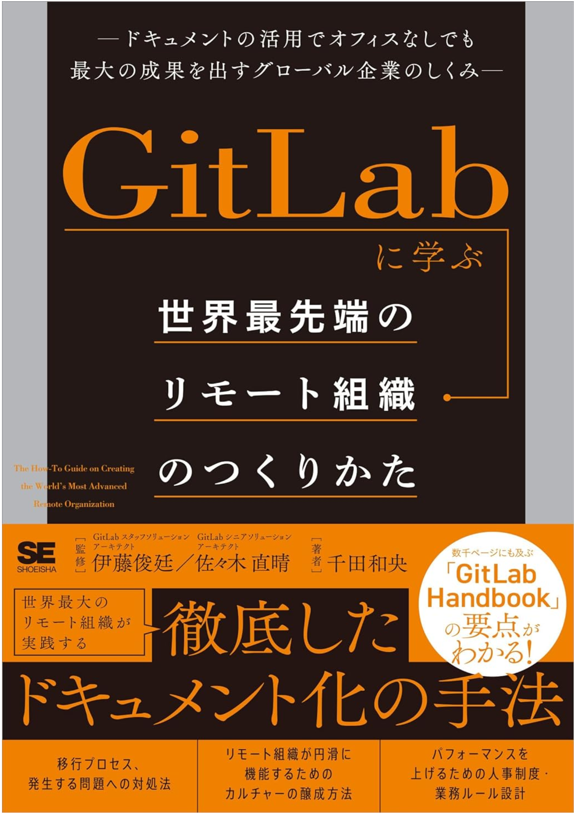

積読していたのをついに読んだので感想を残す。

https://amzn.to/3Xqy5NK

GitLab 自体が世界中で働く人がいてフルリモートの企業です。そんな GitLab が公開している GitLab Handbook の内容を抜粋して紹介するような書籍なので、読んでみて興味が湧いたら GitLab Handbook の方も気になるトピックに目を通してみるといいかもしれません。

https://handbook.gitlab.com/

フルリモートで働くことは非同期を前提として社内の制度やコミュニケーションを設計する必要があり、もっともフルリモートになることが難しいのはハイブリッド型を採用している企業というところが一番印象に残っています。

多くの企業がフルリモートから週何日かの出社を必須としたりしていますが少しでもオフラインかつ同期的なコミュニケーションを取ることはフルリモートへの妨げになるなーと思いました。例えば出社している人とオンラインの人のハイブリッドなミーティングで出社している人は会議室でわちゃわちゃしているけどオンラインの人はほぼ発言しないというようなことは誰しも一度は経験しているような気がします。（出社している人もそれぞれ別の席からオンラインで参加すると緩和できることは Tips としてしられている）

これはあくまで一つの例で、ハイブリッドであることでどうしてもオフラインがオーナーとなりオンラインはフォロワーとなるような構造が至る所で発生するようになりオンラインの人が孤独になる。そして辞めていく（言い過ぎかもしれない）。

孤独については著書の中にもでてきます。ビロンギング（Belonging）といって自分の居場所はここであると感じていることで、ビロンギングを感じている従業員はエンゲージメントが６倍高いことが確認され、仕事のパフォーマンスが 56%向上し、退職リスクが 50%低下し、病気による欠勤日数が 75 日減少するらしいです。

読んでるとそんなことまでドキュメントに残すの？と思うこともあるのですがそれこそ必要なことなのでしょう。
