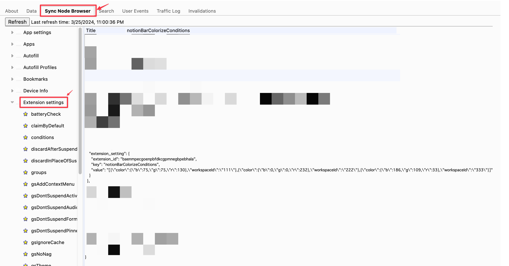

## option 画面の devtool を表示する

extention の devtool を開くには`chrome://extensions/?id={your extension id}`を開いて Inspect views に表示されているリンクをクリックすると表示できます。しかしここには設定画面のリンクが出てこないです。

設定画面のリンクを表示するには設定画面を開いた状態で`chrome://extensions/?id={your extension id}`を開くと表示されます。

## storage の内容を確認する

chrome の storageAPI を使うとログインしている Google アカウント設定を共有させたりすることができる。

https://developer.chrome.com/docs/extensions/reference/api/storage?hl=ja

デバッグ時にちゃんと保存されているのか？を確認するには`chrome://sync-internals/`にアクセスして画像のように`Sync Node Browser`を選択、`Extension settings`を選択、自分の開発している extension のところを開くと実際に保存されている JSON を確認することができます。

## Unchecked runtime.lastError: Could not establish connection. Receiving end does not exist. というエラー

ローカルで extension を読み込ませているとめちゃめちゃ出るこのエラーは更新されたあとに extension を使ってるタブをリロードしていないと出るエラーです。消すにはタブをリロードすればよいです。
