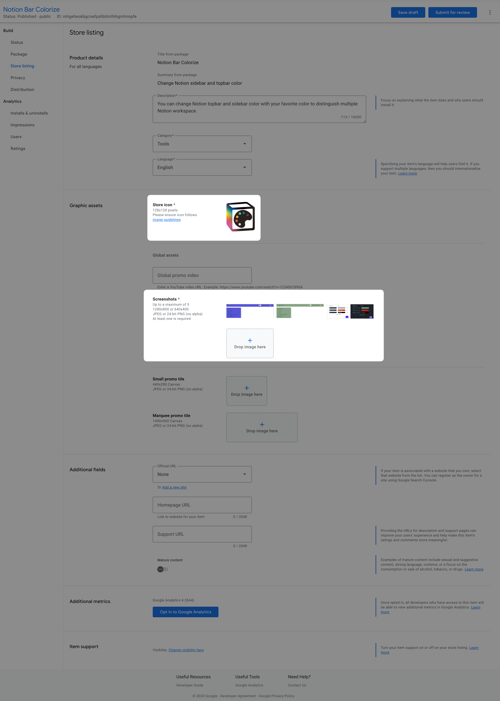
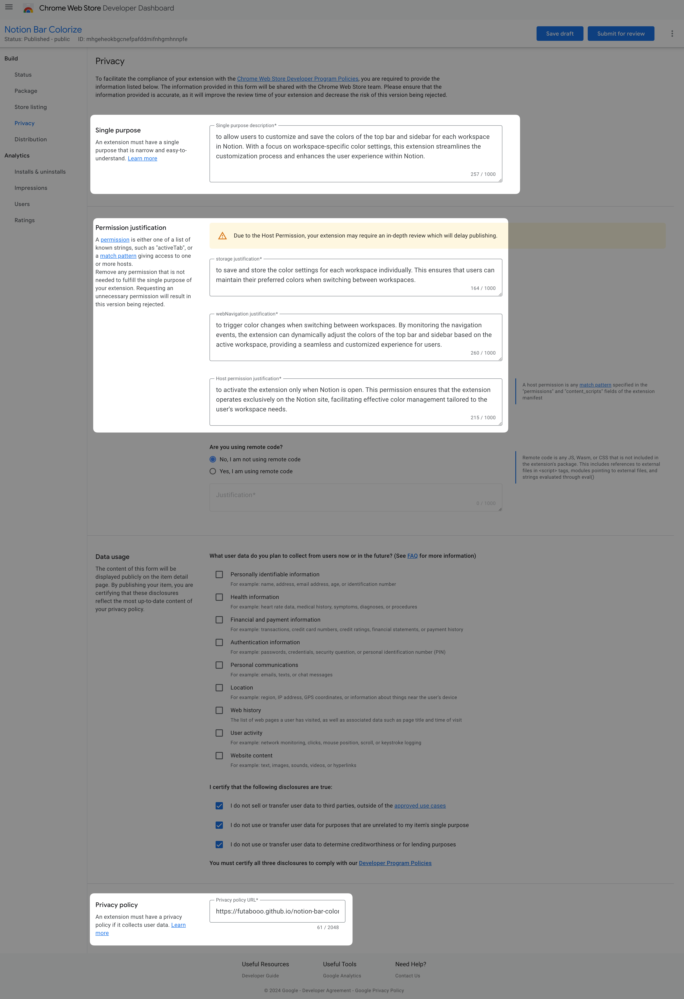

# はじめに

Chrome Extension を作ったのでどのように作ったのか、また公開する上で必要となった情報をまとめておくことでまた作りたくなったらふりかえられるようにしておきます。

完成系のコードは GitHub にて公開しているので参考にしてください。

https://github.com/futabooo/notion-bar-colorize

# 開発

## CRXJS Vite Plugin をつかって TypeScript で開発する

開発者体験をよくしたいので何かしらフレームワークを使うことを検討しました。
調べ始めたころは[Plasmo](https://www.plasmo.com/)を使おうかとも思っていたのですが、色々と機能があるものの Plasmo Way に引っ張られるのも懸念がありました。

Plasmo に比べるとデバッグやストアへの公開など自分で環境を用意したりする必要がありますが、[CRXJS Vite Plugin](https://crxjs.dev/vite-plugin)を使って TypeScript で開発できるというところで落ち着きました。

### project の作成

Vite のプロジェクトを作成します。
いくつかインタラクティブに入力する必要があるので framework は Vanilla、variant は TypeScript を選択します。
UI に何かしらフレームワークを使う場合は React や Vue を選んでも問題ありません。

```
npm init vite@latest

? Select a framework: › - Use arrow-keys. Return to submit.
❯   Vanilla
    Vue
    React
    Preact
    Lit
    Svelte
    Solid
    Qwik
    Others

? Select a variant: › - Use arrow-keys. Return to submit.
❯   TypeScript
    JavaScript
```

CRSJS Vite Plugin をインストールします。

```
npm i @crxjs/vite-plugin@beta -D
```

Chrome 拡張機能開発で使う型定義をインストールします。

```
npm i @types/chrome -D
```

`tsconfig.json` を編集して outdir を追加します。これで build 結果を dist 配下に出力するようにします。

```
"outDir": "dist",
```

### manifest.json を用意する

[Manifest JSON | CRXJS Vite Plugin](https://crxjs.dev/vite-plugin/concepts/manifest)にあるように`defineManifest`関数を使うことで TypeScript で Manifest を書いて manifest.json を生成させることができます。Manifest の詳細は[Manifest file format - Chrome for Developers](https://developer.chrome.com/docs/extensions/reference/manifest)に記載があるのでこちらを参考にします。

ここまでやったらあとは作りたい内容に応じて実装を追加していくことになります。

### ローカルで実行してデバッグする

ビルドを実行します。

```
npm rum build
```

dist 配下に出力されるので chrome の extention 追加から unpacked を選んで dist フォルダを選択することで chrome に今回自分が作っている拡張機能をインストールすることができます。

# Chrome Web Store に公開する

Chrome Web Store に公開する際に必須となる情報がいくつかあるので情報を残しておきます。

## 画像を用意する

拡張機能のアイコンとストアで掲載されるスクリーンショットを用意する必要があります。

それぞれサイズの指定がありそれ以外のサイズではアップすることができません。

アイコンは 128px、スクリーンショットは 1280x800 か 640x400 のどちらかです。



## プライバシーポリシーを用意する

公開する拡張機能がどんなものか、使用する API の利用目的、プライバシーポリシーの URL を用意する必要があります。特にプライバシーポリシーの URL は用意するのに一手間必要でなりめんどうなのですが、今回は GitHub Pages で用意することで別途サーバの用意をしなくてもいいようにしました。



### GitHub Pages で プライバシーポリシー を用意する

Jekyll を GitHub Pages として公開するためのものを流用することで実現します。実際に今回作った プライバシーポリシー は[Privacy Policy for Notion Bar Colorize](https://futabooo.github.io/notion-bar-colorize/privacy-policy)です。

docs フォルダをプロジェクトのルートに用意し、privacy-policy.md を作成します。用意したファイルを GitHub Pages として公開するための GitHub Actions を追加します。[privacy policy を GitHub Pages で公開できるようにする #8](https://github.com/futabooo/notion-bar-colorize/pull/8)

GitHub Actions の Deploy Docs を実行することで最初に書いた URL に公開されます。

これまでは GitHub Pages で公開する成果物もリポジトリ管理に含める必要がりましたが、GitHub Actions に生成とデプロイを任せることができるようになっています。

https://github.blog/changelog/2024-03-25-github-pages-with-custom-github-actions-workflows-are-now-generally-available/

### GitHub Discussions でサポートページを用意する

プライバシーポリシーには問い合わせ先が必要になります。[GithHub Discussions](https://github.com/futabooo/notion-bar-colorize/discussions)のリンクをこちらにはりました。質問内容と回答を公開できる、誰でも回答できるようにして用意することで運用コストを削減できると考えたからです。

# おわりに

Chrome Extension を作って公開するところまでを書きました。Chrome Web Store に公開後は管理画面でインストール数やインプレッション数が見れるので毎日見てます。ストア公開の自動化などまだやり残したことがあるのでそのうちやりたいと思います。
