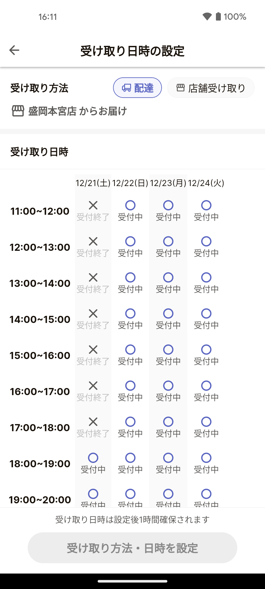
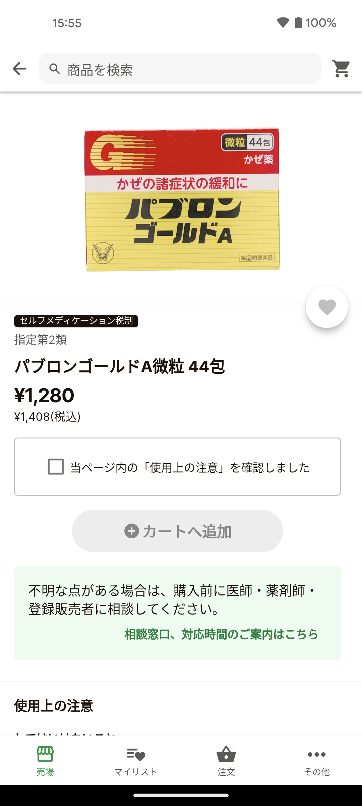

[10X アドベントカレンダー 2024](https://www.notion.so/10xall/10X-2024-1443747cdaf180a4a8dbcd7267044c57)の 24 日目です。23 日目は kiyose さんの[10X の Bizdev の特徴 3 つ](https://note.com/kiyose3170/n/nc2c782d2ca0b)でした。

# はじめに

2020 年 7 月に 10X に入社して 2021 年 3 月に子どもが生まれたので、2024 年 12 月現在 10X 4 年目だし子育ても 4 年目になりました。いわゆる在職エントリーとしてこの記事を残したいと思います。ちなみに 10X の推しポイントは長期間働ける環境構築を心がけてるところです。

# 10X でこれまでやってきたこと

## とあるパートナーの立ち上げ

入社後小さめのタスクをちょこちょことやっていき開発にも慣れてきた頃、とあるパートナーの立ち上げを担当することになりました。当時は Stailer を使ってネットスーパーを提供している既存のパートナーはサイトコントローラーを使っているパートナーのみで私が担当したパートナーが Stailer 初のサイトコントローラー無しパートナーでした。

ひたすら Stailer には無い機能を作り続ける期間が始まります。中でも記憶に残っているのは以下の 2 つの機能です。

### 受け取り日時を設定できるようにする

こんな画面のやつです。

裏側では受け取り日時の設定が可能なユーザーに上限があったり、仮予約的概念があって受け取り日時の設定をしてから一定時間経っても買い物が完了していない場合は設定を自動で解除したりしています。

この画面をつくるために自分が 3 年前に書いた様々なコードや Firestore のドキュメントが今もたくさん残っていますが、最近の開発で少しずつリファクタリングされていくのを見ています。自分自身がやってるわけではないのですが、一度作ったものが作り直されるのを見ていると学びが深いです。理想的には自分が書き換えるのがケジメを付ける？？？的には良いのですがやってくれているメンバーには感謝です。

### ポイントカード連携できるようにする

スーパーやドラッグストアにはポイントカードが当たり前のようにあると思います。Stailer で買い物をしたらポイントがつかないとあっては、普段から店舗でお買い物をしているお客様にとってはアプリを使って注文することがデメリットになってしまいかねません。ポイントカードをアプリからの注文でも使えるように開発をしました。

ポイントカードの連携をする画面を作ったり、1 日の最後に売り上げた注文がどのポイントカードと紐づいているのかバッチで抽出してパートナーへ送ったりする仕組みを作りました。

このときは複雑なポイント計算をすべて Stailer 側に再実装（店舗では POS で良い感じに計算される）する方法をとりましたが、テストも大変だし POS 側に変更があったらそれを取り込むのも開発が必要になるのでこの後担当することがあった別のパートナーの立ち上げでは計算はすべてパートナー側でやって貰う方法をとりました。POS で出されるレシートと Stailer で購入完了画面で出す取得ポイント数が合ってるか？というテストを何回もしたのはいい思い出です。

## OTC 医薬品販売を可能にする

パートナーの立ち上げではないですが記憶に残っている開発としては OTC 医薬品販売を可能にする開発です。ネットで医薬品を買うのはとっても大変で機能開発のみではなく保健所への申請が必要などドメイン知識バチバチに必要とされるところが記憶に残っています。「濫用等のおそれのある医薬品」という言葉を何回も口にしたのは後にも先にもこのときだけだと思います。

## スクリーンリーダーに対応する

最近の価値出したなーと思う開発はスクリーンリーダーへの対応です。会社のブログでも記事を書いたり、FluttterKaigi2024 で登壇したりもしました。

https://product.10x.co.jp/entry/2024/07/01/124355

https://2024.flutterkaigi.jp/session/00af53a6-db85-46b9-a10b-e92a6b1232a4

# 子育て

最近 USJ に家族で行ってきました。
めっちゃかわいい妻と子に会いたい人がいたらうちに遊びに来てください。

## コロナ真っ只中での出産

2021 年 3 月はコロナが全世界で話題になっていた時期です。緊急事態宣言が東京でも発令されたりしていました。この時期の出産だったため、私は病院の中に入ることもできず着替えを受付に預けて駐車場から窓越しに手をふってくれる妻を見て帰るだけということをやっていました。

出産当日は家で連絡をただ待つだけでした。処置室？に入る直前までは LINE で妻から連絡をもらっていました。すべてが終わった後電話で無事を聞けたときは本当に安心しました。

## 育休の半年

生まれてすぐ育休を半年取りました。転職したてなこともあり 3 ヶ月ぐらいですぐ戻りたいなとか思っていたのですが、社長に相談したら半年は絶対に取ったほうがいい！と逆に長く取ることを進められて半年とることにしました。今思えばこの選択は大正解で、短くても半年ながければ 1 年しっかりと育休を取ることをこれからの人には進めたいと思います。

育休中は夜泣き対応のシフトを組んだり、妻と協力して乗り切りました。この時期に覚えたことが後の育児でとても役に立っているので、家庭内で育児の戦力となるためにも育休は取ることをおすすめしたいです。

## 0 歳児、保活、無呼吸？

3 月生まれだったため 0 歳から家の近くの認可保育園に入ることはできず認可外の保育園へバスに乗って通っていました。1 歳から家の近くの認可保育園に入るためにすでに保育園に通っていることで加点されるルールが存在していたので多少遠くても入れるところに入りました。

フルリモートで在宅で仕事をしていなかったらこの送り迎えもかなりしんどかったと思いますが会社に助けられていました。

この時期寝ている時に呼吸していないのでは？と感じることがあり入院を経験しました。結果的に無呼吸にはなっていなかったのがわかったのでよかったです。

## 1 歳児、保育園の洗礼をうける

無事家の近くの区の保育園に転園することができ、送り迎えが徒歩 5 分で終わる最強の環境をえることができました。しかし母乳をやめてミルク中心になるとこれまで母親から分け与えられていた免疫がなくなりノーガードになるため、すぐに熱を出したり風邪を引いたりするようになって頻繁に早めにお迎えに行くことや保育園を休むことがありました。幸いにも我が家は夫婦ともに在宅で働いていたのでお互い時間を決めて子の面倒をみることでなんとか乗り切ることができました。

## 2 歳児、いろんなところへお出かけする

ミルクも終わり、離乳食がはじまり、ご飯の用意が最悪の場合でも出先で買うことができるような状況になってきていろいろなところへお出かけするようになりました。水族館や、いちご狩り、サンリオピューロランド、ディズニーランド、祖父母の家などです。

言葉も喋るようになり、よく子育て先輩たちから話に聞いていた「なぜ？」とか「あれなに？」がでてくるようになり、興味あることに何でも聞いてきたと思ったらまた別のなにかにすぐ興味が移って別のなぜなにを言ってたり社会とのつながりがとっても増えてきました。

## 3 歳児、自己主張がはげしくなる

大人と同じものを少し薄味にしたり、小さく切ってあげたりする程度で食べられるようになってきたこの時期には自己主張がはげしくなってきました。いわゆるイヤイヤ期というものかも知れません。朝保育園に着ていく服を準備してあげても「あっちのあの服が良い」と言われたり、ご飯を作って出しても「トマトが食べたい」と言ってきたり（昨日はトマト嫌いって言ってたのに）します。こちらがヒートアップして言うことを聞かせようとしても平行線になるだけなので、子どもが納得してくれるように説明をするというのが必要です。なんの理由もなくわがままで言ってることもたまにあるのでそれは駄目だとしかりますが、大半の場合は子どもなりの理由があって言ってきてるのでちゃんと説明して納得してもらえると出した服着てくれるし、出したもの食べてくれます（当たり前のことな気もするが！）。

## 子育てから見えること

なんでもかんでも興味を持つし、なんでもかんでも自己主張してくるので親には子どもに納得してもらうために説明する能力というのが不可欠だと日々感じています。これができないで子どもと言い合いになってる毎日ではあるので反省しかありません。。

他方で、どうして子どもは何でも興味を持つし何でも自己主張するのか少し引いたところから見てみると、経験がないことによって心のブレーキがかからない状態なのではないかと思うようになりました。物理的にもそうで、高いところから落ちたら痛いことを知らないので椅子の上に登って落ちて頭打って泣き叫ぶ経験を経て高いところから落ちると痛いことを覚え、登るのをやめるようになったりします。

新しいことにチャレンジするうえで経験からくる心のブレーキが邪魔をすることもあるのが大人である、ということが見えてきます。

# EM（エンジニアリングマネージャー） になったので大切にしていきたいこと

これまでの仕事経験でスクラムマスターをやったことがあるのでプロジェクトマネジメントは一定の経験がありますが、EM は人生初です。EM としてメンバーが心のブレーキをはずしてチャレンジできる環境にするということは常に念頭に置いて働いていきたいと思っています。

# おわりに

10X も子育ても 4 年目、人生の長さからしたらまだまだ短いです。長く経験しないとわからないこともたくさんあるので引き続きやっていきたいと思います。

明日は [@yutatatatata](https://x.com/yutatatatata)さんの商品の"価格"のお話の予定です。
