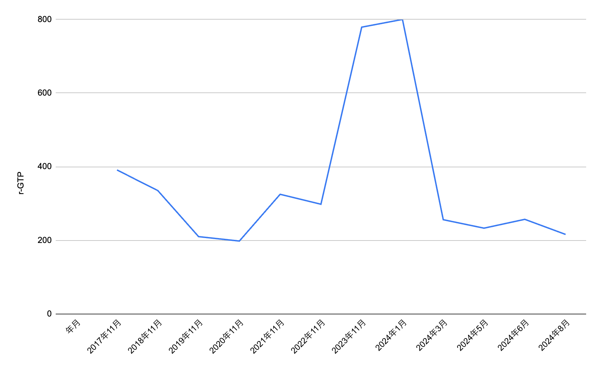

[mhidakaが建立した Advent Calendar 2024](https://adventar.org/calendars/10958)の11日目です。人気で[その2](https://adventar.org/calendars/10964)もあります。

# mhidakaさんとfutabooo

mhidakaさんとはDroidKaigi2018の運営を通してお知り合いになった気がします。

記憶が定かでなくてメールやTwitterをさかのぼってみましたが、こんなのが見つけられた程度でした。

https://x.com/futabooo/status/961804014802251776

そんなmhidakaさんを最近FlutterKaigi2024の会場で発見しましたがタイミング合わずご挨拶はできず。

ということでここで生存報告でもしようと思いAdvent Calendarに参加しました。

# γ-GTP（ガンマ・ジー・ティー・ピー）の歴史

生存報告ということで自分のγ-GTP（ガンマ・ジー・ティー・ピー）の歴史を振り返ってみました。

γ-GTP（ガンマ・ジー・ティー・ピー）は肝臓の健康状態を測る数値の一つです。

男性の正常値は50以下だそうです。私はここ数年50以下になることはなかったですが生きています。

毎年受けていた健康診断の結果を2017年から順に乗せてます。

2024年は前年の健康診断の結果が急上昇したため通院と薬での治療を続けた期間です。

最近受けた検査でお医者さんからは「原因不明、薬を使っても下がらないが検査でわかる病気はなにもないので健康診断などで定期的に数値を見てください、腹部エコーもやってください」と言われるだけでした。

これ以上は生検といって身体に穴開けて細胞を取るぐらいしか検査が残ってないらしいのですがそれもまたリスクがあるので無しになりました。

直近は減少傾向なので普段の生活習慣には気をつけていきたいものです。

# おわりに

γ-GTP（ガンマ・ジー・ティー・ピー）とは別の話ですが2021年の健康診断ではメタボリックシンドロームの診断もされていました。

その日から週1回個人フットサルに通うようになって、1年通ってたら次の年の健康診断では問題なくなっていました。運動大事ですね。それ以来いまも個人フットサルへの参加は続けています。

副作用？として体力もついてきており月1で社会人の友達と出ているソサイチの大会では、最年長だけど一番動けるみたいになりました。フットサルやソサイチのお誘いがもしあれば[@futabooo](https://x.com/futabooo)までご連絡ください。走ります。

明日はytRinoさんです。