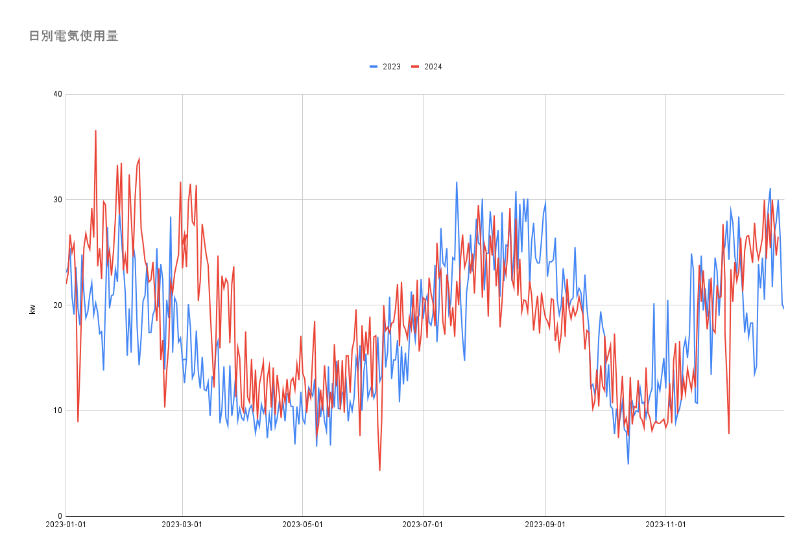
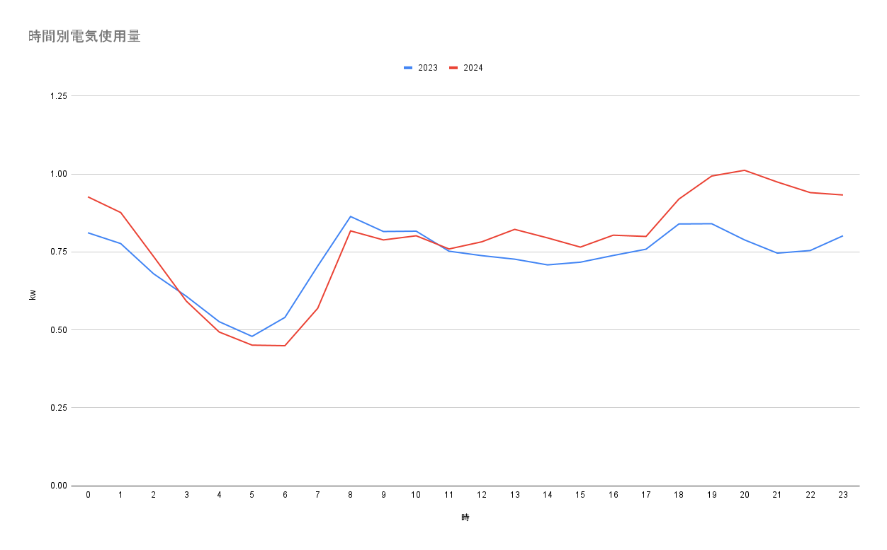

以前見直してから 2 年ほどたっていたのでまた見直してみた。

https://futabooo.hatenablog.com/entry/2022/05/30/020313


# 結果

時間帯の傾向はあいかわらずだが2023年に比べて2024年は使用料自体が増えていた。電気料金が上がったことで電気料金が上がったのは事実だけど、生活や家電の変化も影響して使用料自体も増えていた。





# 取得方法

myTokyoガスにログインして使用料を開く。ブラウザのinspectorを見てみるとgraphqlのリクエストを送っているのが分かる（2年前は使ってなかったのに進化している）。これをcopy as curlしてきてfor分でいい感じに日付を変更できるようにしてあげると以下のようになるはず。

```shell
for d in {2023..2023}-{01..12}-{01..31}; do
  date=$(date -j -f "%Y-%m-%d" "$d" "+%Y-%m-%d")
  echo -n "$date," >> electricity_usage_2023.csv
  curl -s 'https://members.tokyo-gas.co.jp/graphql' \
   -H 'accept: application/json' \
   -H 'accept-language: ja,en-US;q=0.9,en;q=0.8' \
   -H 'content-type: application/json' \
   -b 'mtg-hmid={mtg-hmid}; withdesk-id={withdesk-id}; two-factor-auth-sesion-id={two-factor-auth-sesion-id}; two-factor-auth-token={two-factor-auth-token}; mtg-login-context-id={mtg-login-context-id}; mtg-session-id={mtg-session-id}; '\
   -H 'dnt: 1' \
   -H 'origin: https://members.tokyo-gas.co.jp' \
   -H 'priority: u=1, i' \
   -H 'referer: https://members.tokyo-gas.co.jp/usage?tab=electricity' \
   -H 'sec-ch-ua: "Not:A-Brand";v="24", "Chromium";v="134"' \
   -H 'sec-ch-ua-mobile: ?0' \
   -H 'sec-ch-ua-platform: "macOS"' \
   -H 'sec-fetch-dest: empty' \
   -H 'sec-fetch-mode: cors' \
   -H 'sec-fetch-site: same-origin' \
   -H 'user-agent: Mozilla/5.0 (Macintosh; Intel Mac OS X 10_15_7) AppleWebKit/537.36 (KHTML, like Gecko) Chrome/134.0.0.0 Safari/537.36' \
   --data-raw "{\"operationName\":\"HourlyElectricityUsage\",\"variables\":{\"contractIndexNumber\":1,\"electricityContractNumber\":\"$electricityContractNumber\",\"targetDate\":\"$date\"},\"query\":\"query HourlyElectricityUsage(\$contractIndexNumber: Int\\u0021, \$electricityContractNumber: String\\u0021, \$targetDate: String) {\\n hourlyElectricityUsage(\\n contractIndexNumber: \$contractIndexNumber\\n electricityContractNumber: \$electricityContractNumber\\n targetDate: \$targetDate\\n ) {\\n averageUsageForSameContract\\n date\\n usage\\n __typename\\n }\\n}\"}" \
   | jq '.data.hourlyElectricityUsage | sort_by(.date) | map(.usage) | join(",")' >> electricity_usage_2023.csv
  sleep 1
done
```

