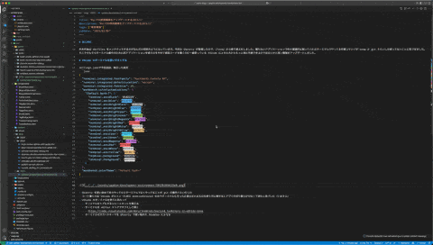
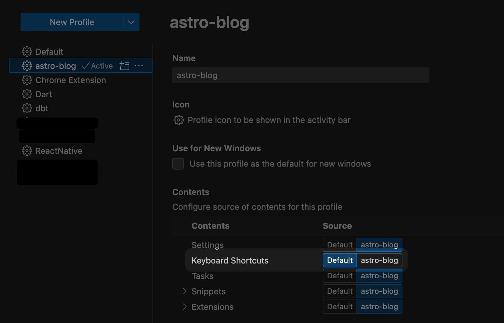
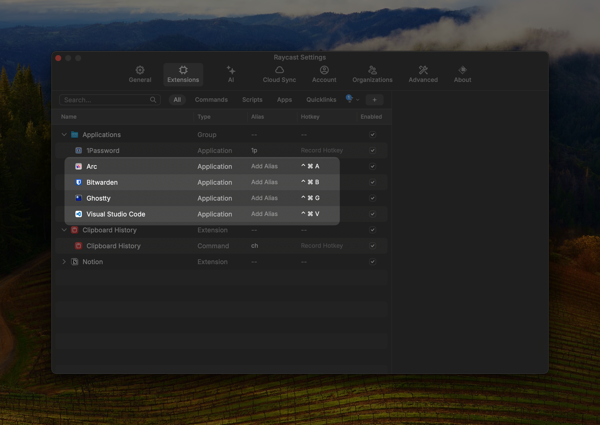

# はじめに

年末年始は dotfiles をメンテナンスするのがなんだか恒例のようになっています。今年は Ghostty が登場したので、iTerm2 から乗り換えをしました。慣れないアプリケーションで色々意識的に触っていたらターミナルでやってる作業コマンドが brew か git ぐらいしか使ってないことに気づきました。。そこでそもそもターミナル操作のために別アプリケーションを使うのをやめて普段コードを書くのに一番使っている VSCode によせられたらもっと楽に作業できるのではないかと思い VSCode をいじりつつ、Mac での開発環境をアップデートしました。

# VSCode のターミナルを使いやすくする

## settings.json の設定

- フォントをこれまで iTerm2 で使っていたものに変更する
  - プロンプトに[Starship](https://starship.rs/)を使っているので Nerd Font を指定しています
- ターミナルをパネルではなくエディターで開くようにする
  - パネルだと表示領域が小さいのでエディターにします
- ターミナルのフォントサイズをエディターより少し小さく設定する
  - 表示領域に対して少しでも情報を増やすためです
- ターミナルのカラーをカスタマイズする
  - Ghostty のテーマにあった DoomOne に近いものにします、色の設定は AI に聞いたらいい感じに生成してくれました
  - エディターとして開くけどターミナルであることをビジュアルで分かりやすくするためです

```json
{
  "terminal.integrated.fontFamily": "HackGen35 Console NF",
  "terminal.integrated.defaultLocation": "editor",
  "terminal.integrated.fontSize": 15,
  "workbench.colorCustomizations": {
    "[Default Dark+]": {
      "terminal.ansiBlack": "#1B2229",
      "terminal.ansiBlue": "#51AFEF",
      "terminal.ansiBrightBlack": "#5B6268",
      "terminal.ansiBrightBlue": "#51AFEF",
      "terminal.ansiBrightCyan": "#46D9FF",
      "terminal.ansiBrightGreen": "#98BE65",
      "terminal.ansiBrightMagenta": "#C678DD",
      "terminal.ansiBrightRed": "#FF6C6B",
      "terminal.ansiBrightWhite": "#DFDFDF",
      "terminal.ansiBrightYellow": "#ECBE7B",
      "terminal.ansiCyan": "#46D9FF",
      "terminal.ansiGreen": "#98BE65",
      "terminal.ansiMagenta": "#C678DD",
      "terminal.ansiRed": "#FF6C6B",
      "terminal.ansiWhite": "#DFDFDF",
      "terminal.ansiYellow": "#ECBE7B",
      "terminal.background": "#282C34",
      "terminal.foreground": "#DFDFDF"
    }
  },
  "workbench.colorTheme": "Default Dark+"
}
```

## keybindings.json の設定

- デフォルトで`cmd+j`に設定されているパネルをトグルするショートカットを無効にする
- その代わりにエディターで新しくターミナルを開くコマンドへ`cmd+j`を設定する

```json
[
  {
    "key": "cmd+j",
    "command": "-workbench.action.togglePanel"
  },
  {
    "key": "cmd+j",
    "command": "workbench.action.createTerminalEditorSide"
  }
]
```

## VSCode でターミナルが開く様子

ここまでやると`cmd+j`を押したらターミナルが開くようになります。



とはいえ、結局ターミナルでやることは git の操作なので VSCode の GitLens を使いこなせるよになった方が作業は捗るかもしれません。

## profiles の設定

直接ターミナルの起動には関係ありませんが、私は VSCode の profiles を使っていて作業するプロジェクトや特性に合わせて拡張機能や設定を変えているのでキーバインディングはデフォルトを使うようにして個別の設定はしなくていいようにしました。



# アプリケーションの切り替えをアップデートする

これまでは Mac の仮想 Window によく使うアプリケーションをひとつづつおいて Window を切り替えることでアプリケーションを切り替えるような使い方をしていました。やりたいのはアプリケーションの切り替えなので Raycast のホットキーを使ってアプリケーションの切り替えをするように変更しました。



ホットキーに設定するキーはもっと単純にしたかったのですが既存のショートカットと競合するのでこんな感じになりました。`ctrl+数字`とかにできるとよかったですが数字にするとどのアプリケーション起動しようとしているのか分からなくなりそうだったので頭文字にしています。`ctrl+a`を使うと行頭へ移動するショートカットが使えなくなって困ったのでやめました。

# おわりに

普段慣れてる作業は一回俯瞰してみないと見直しできないのでいい機会になりました。年 1 だとちょっともったいない気がするのでもう少し短いスパンで見直せるようにしたいと思いました。
