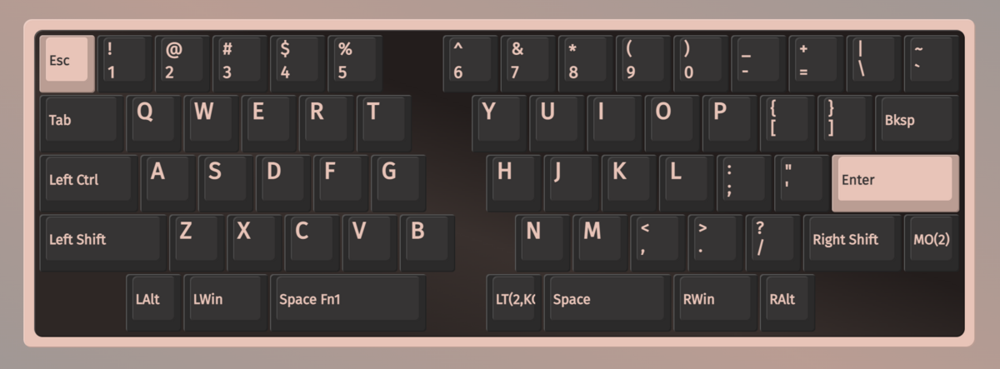
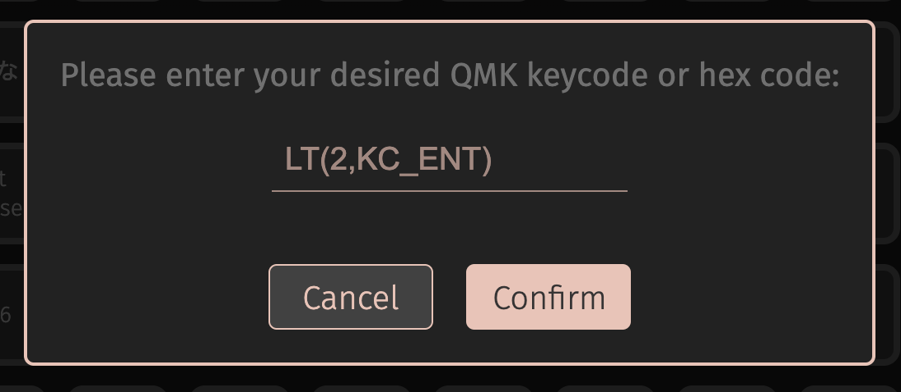
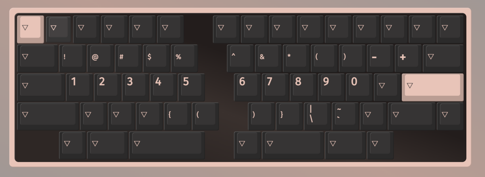
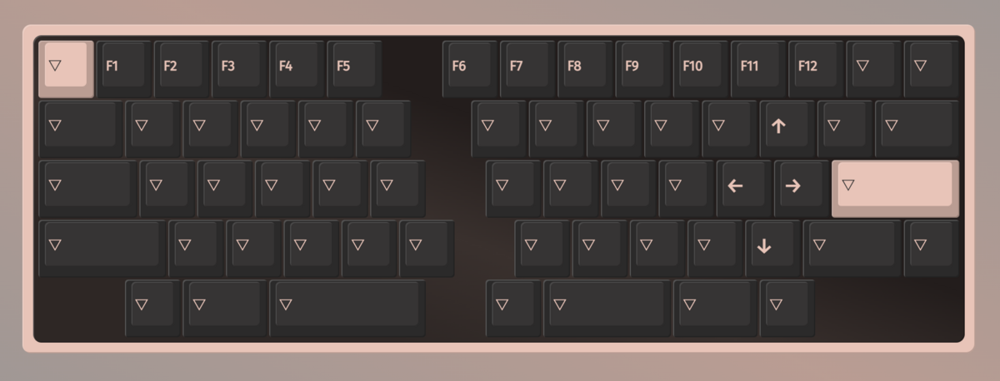

だいぶ左右分割にもなれてきて、最近は[ホームポジション](https://d.hatena.ne.jp/keyword/%A5%DB%A1%BC%A5%E0%A5%DD%A5%B8%A5%B7%A5%E7%A5%F3)からの移動や[トラックボール](https://d.hatena.ne.jp/keyword/%A5%C8%A5%E9%A5%C3%A5%AF%A5%DC%A1%BC%A5%EB)への手の移動を何とかさせたいなーと思うようになってきました。
標準のキーレイアウトから離れるのはあまり気乗りしないものの、ほぼ家で自分のキーボードしか触らないのでやることにしました。

Choco60 rev.2はviaを使ったキーマップの変更に対応しておりブラウザでポチポチするだけでレイヤーへのキーの設定を追加することができました。

<iframe src="https://hatenablog-parts.com/embed?url=https%3A%2F%2Fwww.caniusevia.com%2F" title="VIA | VIA" class="embed-card embed-webcard" scrolling="no" frameborder="0" style="display: block; width: 100%; height: 155px; max-width: 500px; margin: 10px 0px;" loading="lazy"></iframe>
<cite class="hatena-citation"><a href="https://www.caniusevia.com/">www.caniusevia.com</a></cite>

設定した内容は一旦[ホームポジション](https://d.hatena.ne.jp/keyword/%A5%DB%A1%BC%A5%E0%A5%DD%A5%B8%A5%B7%A5%E7%A5%F3)からの移動が激しい端っこにあるキーを別のレイヤーに設定してみるやつで始めてみようと思います。

#### レイヤ−0

右手親指のスベース左にあるキーには短く押すとエンター、押しっぱなしにするとレイヤー2への切り替えとなるようにAnyキーを割り当てました。

他のレイヤーに当てたキーを無くすのはまだ怖くてやってないですがレイヤー切り替えになれ始めたら消そうと思います。

#### レイヤー1

数字キーや記号を集めたレイヤー
カッコの左右を手の左右にすることができるのわかりやすそう

#### レイヤー2

もともとfnキー押しながらやっていたようなキーをここに設定した