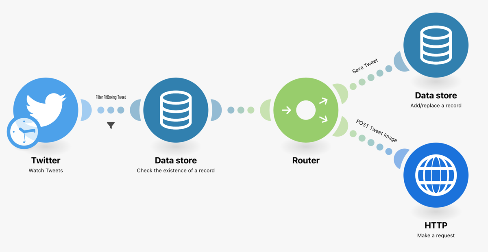
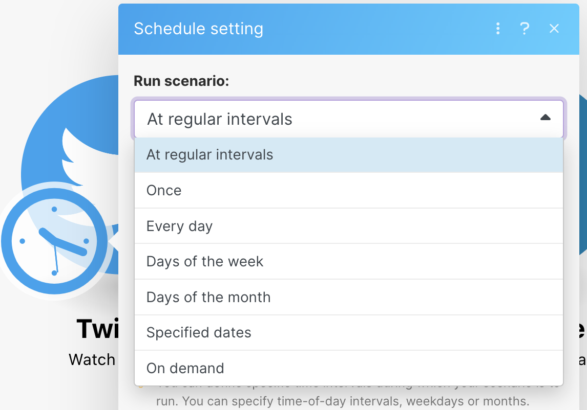
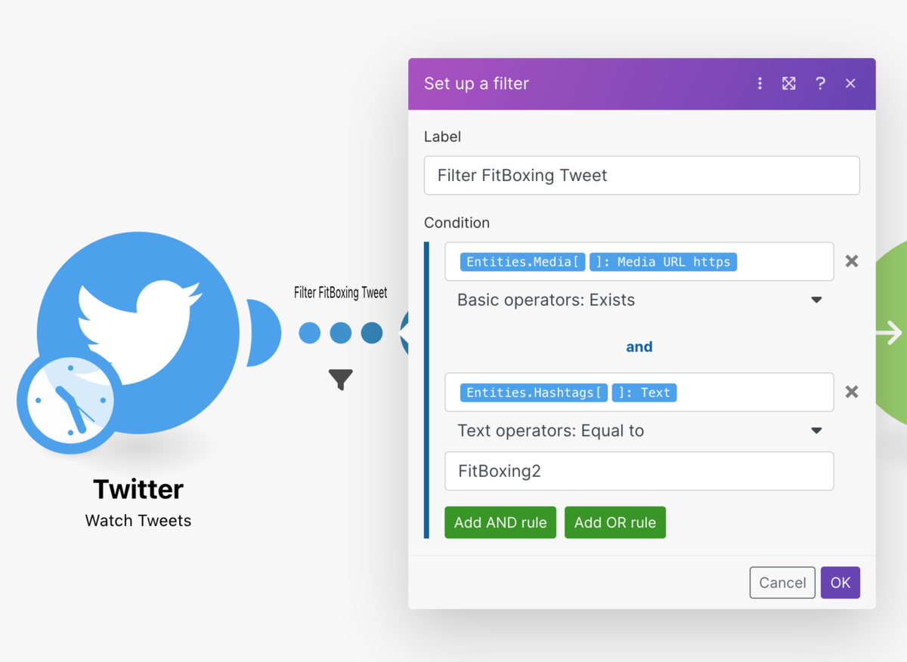
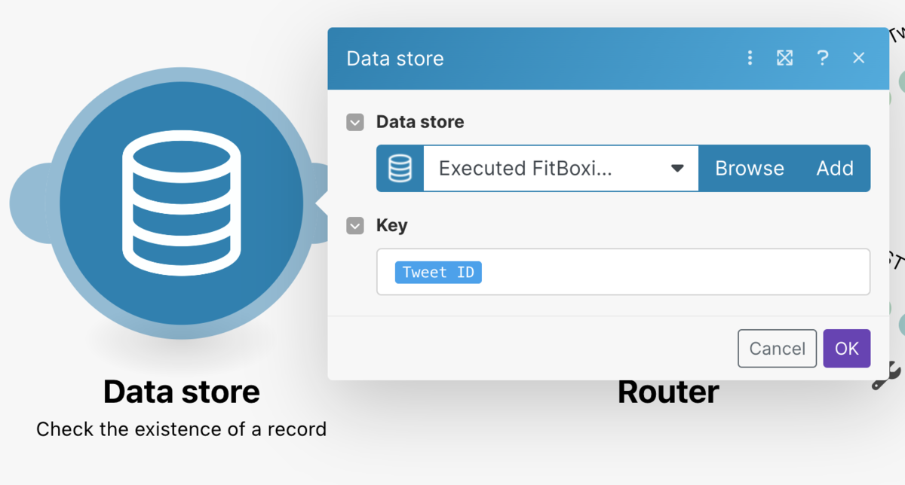
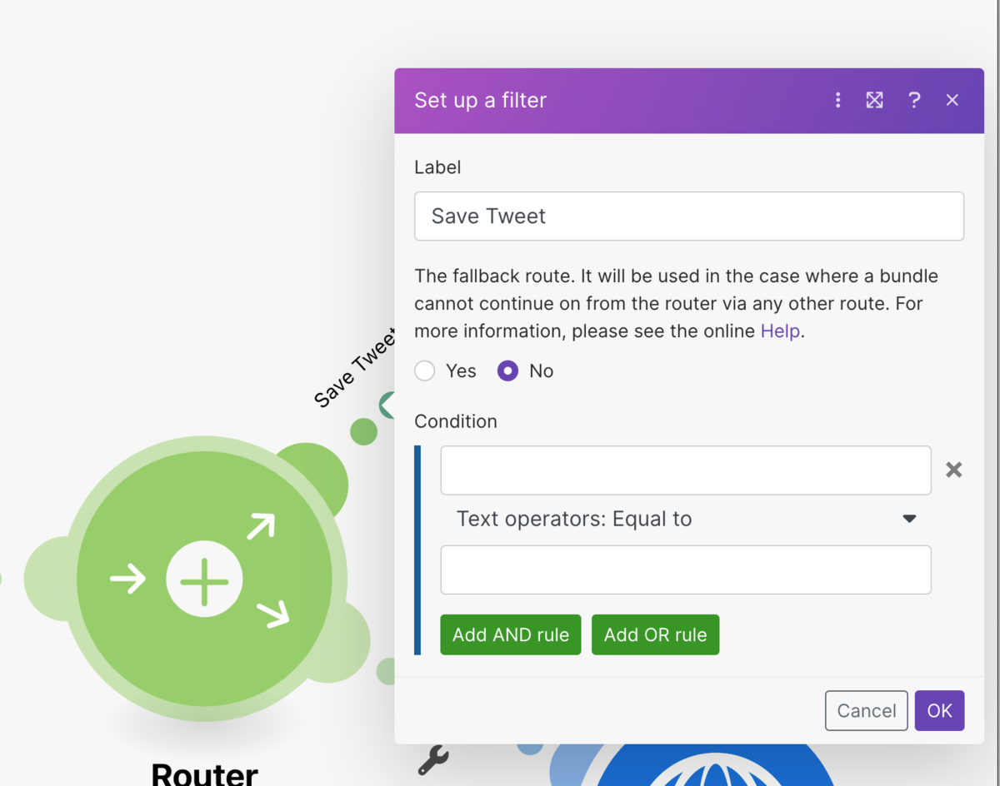
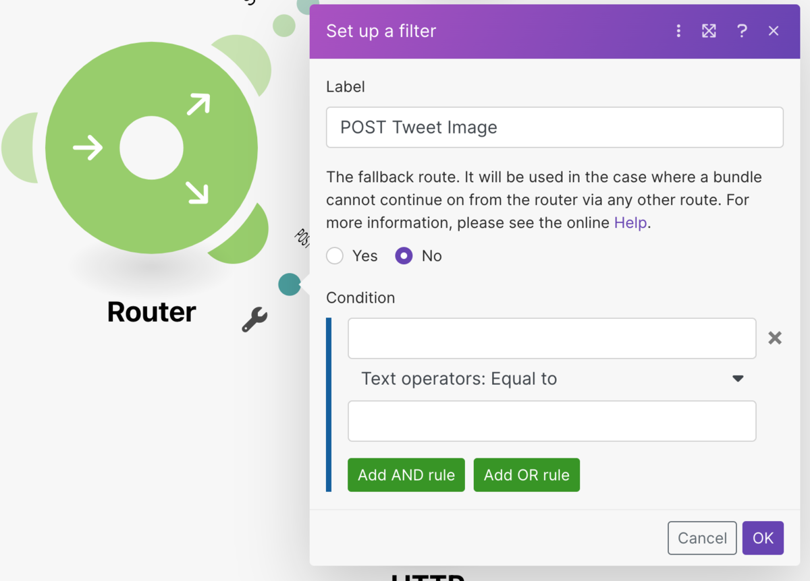
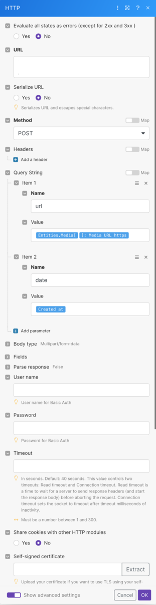

FitBoxing2の記録をつけたいなーと思いZapierで最初やろうと思ったけどPOST requestするのに月2千円は払えないなぁと思ってしまったので[Make（旧Integromat）](https://www.make.com/en)を使ってやってみました。

全体像
---

今の所運用してるワークフローはこんな感じ。

### 大まかな流れ

1.  15分に1度5件ツイートを取得する
2.  \#FitBoxing2の[ハッシュタグ](http://d.hatena.ne.jp/keyword/%A5%CF%A5%C3%A5%B7%A5%E5%A5%BF%A5%B0)があるツイートは次のステップへ進む
3.  ツイートIDがData storeに保存されていなかったら次のステップへ進む
4.  Routerで処理を2つに分岐させる
5.  1つはData storeへツイートIDを保存する、もう一つはPOST requestを発行する

ツイートの取得
-------

Zapierのようにツイートするごとにトリガーするようなものが無いので時間間隔を設定したり、特定の時間を指定したりしてトリガーを設定できます。

今回は15分に一回5件のツイートを取得するようなトリガーを設定しました。

またモジュール（Makeでは、丸いのがモジュール）間の点はフィルターが設定することができるので、次のステップへ進むのは画像つきで#FitBoxing2の[ハッシュタグ](http://d.hatena.ne.jp/keyword/%A5%CF%A5%C3%A5%B7%A5%E5%A5%BF%A5%B0)付きツイートだけというフィルターを設定しました。

Date storeにツイートIDが保存済みかどうか確認する
------------------------------

画像つきで#FitBoxing2ありのツイートだけ
すでにPOST requestを作成したトリガーとなったツイートIDは最後にData storeへ保存しているので、そのIDが存在するかを確認しています。

ツイートIDが存在しなければ次のステップへ進みます。

Routerで処理を2つに分ける
----------------

未処理のツイートだったらData storeへのID保存をPOST requestの作成をやるようにRouterで処理を2つに分岐させています。

POST requestする
--------------

ツイートの画像URLとツイートした日時を特定のURLにPOSTします。
受け口はCloudRunを用意していてそこではCloudVisionAPIを使って消費消費カロリーを抽出、pxelaへPOSTして記録するという流れを実装しています。

<iframe src="https://hatenablog-parts.com/embed?url=https%3A%2F%2Fpixe.la%2Fja" title="Pixela | あなたの頑張りや継続を記録し、育てたい。そのすべてを、APIで。" class="embed-card embed-webcard" scrolling="no" frameborder="0" style="display: block; width: 100%; height: 155px; max-width: 500px; margin: 10px 0px;" loading="lazy"></iframe>
<cite class="hatena-citation"><a href="https://pixe.la/ja">pixe.la</a></cite>

おわりに
----

これでフィットボクシングしたらSwitchからツイートすることで消費カロリーの草を生やすことができるようになりました。

それにしても[Make（旧Integromat）](https://www.make.com/en)ってなんて検索しづらいんだ、、、ほとんど日本語の情報出てこないですね。